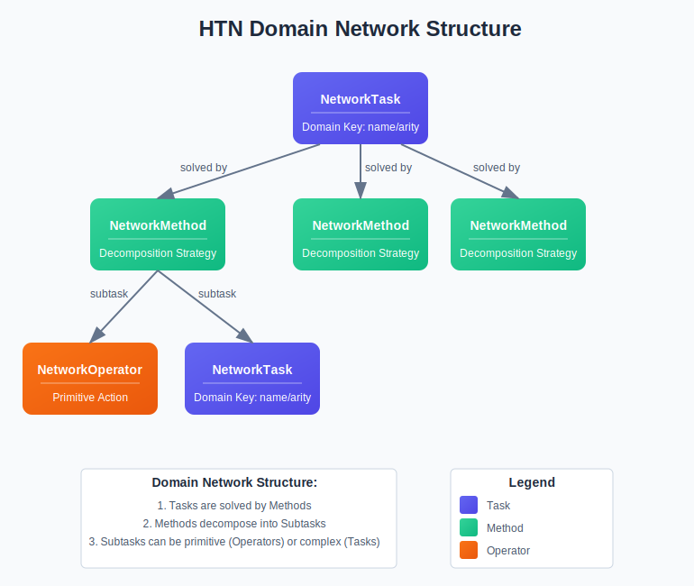

# PyHTN (Python HTN Planner)

## Overview

This project implements a reactive, open-world Hierarchical Task Network (HTN) planner in Python. 
HTN planning is a powerful technique that decomposes high-level tasks into simpler subtasks using a hierarchy of methods and operators. 
Unlike closed-world planning, where HTNs generally have knowledge of how operators effect the world and can therefore directly modify the world state, open-world
planning systems generally assume latent actors in the world, which means it's not easy to know exactly how an agent's actions affect the world. This planner is reactive
in that actions (operators) are executed in the world as they are encountered, the world state is refreshed, and the HTN determines the next appropriate course of action, backtracking if necessary.

This planner supports:
- Hierarchical task decomposition
- Backtracking when plans fail
- Comprehensive execution tracing and logging
- Interactive planning mode

This project draws inspiration from [SHOP2 (Simple Hierarchical Ordered Planner No. 2)](https://www.cs.umd.edu/~nau/papers/nau2003shop2.pdf). 

## Installation

Install the package directly from GitHub using pip:

```bash
pip install git+https://github.com/yourusername/htn-planner.git
```

## Quick Start Guide

### Creating a Network



A network consists of a dictionary mapping task signatures to lists of methods. See the next section for a description of tasks, methods, and operators.

```python
from pyhtn.domain.method import NetworkMethod
from pyhtn.domain.operators import NetworkOperator
from pyhtn.domain.task import NetworkTask

# Create a simple task network for a robot to make coffee
network = {
   # Task signature: "make_coffee/0" (task name/number of arguments)
   'make_coffee/0': [
       NetworkMethod(
           name='make_coffee',
           subtasks=[
               NetworkOperator(name='get_mug', effects=[], args=[]),
               NetworkOperator(name='add_coffee', effects=[], args=[]),
               NetworkTask(name='heat_water', args=[]),
               NetworkOperator(name='pour_water', effects=[], args=[]),
           ],
           preconditions=[]
       )
   ],
   'heat_water/0': [
       NetworkMethod(
           name='heat_water',
           subtasks=[
               NetworkOperator(name='fill_kettle', effects=[], args=[]),
               NetworkOperator(name='turn_on_kettle', effects=[], args=[]),
               NetworkOperator(name='wait_for_boil', effects=[], args=[]),
           ],
           preconditions=[]
       )
   ]
}
```

### Tasks

There are two main types of task classes:

1. **NetworkTask**: Represents tasks in the network definition with potential variable arguments.
2. **GroundedTask**: Represents concrete task instances with specific arguments to be executed.

Tasks are the fundamental units that the planner tries to accomplish, and consist of:
- A name
- A list of arguments (can be variables or concrete values)

Example:
```python
from pyhtn.domain.task import NetworkTask, GroundedTask
from pyhtn.domain.variable import V

# Task with variable arguments
network_task = NetworkTask(name="move", args=(V("source"), V("destination")))
```

GroundedTasks are primarily used internally to the planner, for example when specifying tasks to plan for, or when 
propagating arguments from a method execution to a subtask. You will generally not need to interface with them.

### Methods

Methods define how to decompose tasks into subtasks. A method has:
- A name (currently, must be the same as the parent task)
- Preconditions (conditions that must be true for the method to be applicable)
- A list of subtasks (NetworkTasks and NetworkOperators) that accomplish the task 

There are two method classes:
1. **NetworkMethod**: Methods as defined in the network
2. **GroundedMethod**: Methods with grounded/bound variables

Example:
```python
from pyhtn.domain.method import NetworkMethod
from pyhtn.domain.task import NetworkTask
from pyhtn.domain.variable import V

move_method = NetworkMethod(
    name="move_to_target",
    args=(V("source"), V("destination")),
    preconditions=None,
    subtasks=[
        NetworkTask(name="walk", args=(V("source"), V("destination")))
    ]
)
```

This code defines a method *move_to_target* and can be used for a task of the same name. It has no preconditions, meaning
it is always applicable, takes two arguments, a *source* and a *destination*, and has one subtask, *walk*. Plainly, this method 
indicates that it can achieve the task of moving to a target by using the strategy: walk there. During planning, the argument variables will 
be bound to the input values and subsequently propagated to the sole subtask, *walk* (note that the method argument variables and 
the task argument variables share the same name. This is why the values are propagated in this way. See () for more details).

Like tasks, GroundedMethods are used internally to the planner.

### Operators

Operators represent primitive actions that can be executed directly. They have:
- A name
- A list of arguments
- Preconditions
- Effects (changes to the state when executed)

Like methods, operators exist in two forms:
1. **NetworkOperator**: Defined in the network with variables
2. **GroundedOperator**: Operators with specific bindings

Example:
```python
from pyhtn.conditions.fact import Fact
from pyhtn.domain.operators import NetworkOperator
from pyhtn.domain.variable import V

walk_operator = NetworkOperator(
    name="walk",
    args=(V("source"), V("destination")),
    preconditions=Fact(agent_at=V("source")) & Fact(connected=V("source"), to=V("destination")),
    effects=[]
)
```

This code defines a primitive operator *walk* that can be executed directly. It takes two arguments: *source* and *destination*. The preconditions specify that this operator is only applicable when the agent is at the source location and there's a connection from the source to the destination. In this example, no effects are specified as they would be handled by the environment executing the action. During planning, when this operator is encountered and its preconditions are satisfied, the planner will execute the walk action with the bound argument values.

### Instantiating a Planner

```python
from pyhtn.planner.planner import HtnPlanner

# Create a simple environment that manages the state
class Environment:
    def __init__(self, initial_state):
        self.state = initial_state
        
    def get_state(self):
        return self.state
        
    def execute_action(self, action_name, action_args):
        print(f"Executing: {action_name} with args {action_args}")
        # Update state based on action
        if action_name == "grind_beans":
            self.state.append({"has_ground_coffee": True})
        elif action_name == "heat_water":
            self.state.append({"has_hot_water": True})
        elif action_name == "brew_coffee":
            self.state.append({"has_coffee": True})
        return True

# Initial state
initial_state = [
    {"has_coffee_beans": True},
    {"has_water": True}
]

# Create environment
env = Environment(initial_state)

# Create planner with key options
planner = HtnPlanner(
    network=network,
    env=env,
    enable_logging=True,     # Enable detailed logging
    log_dir="logs/planner.log"  # Log directory
)
```

In this code, we first create an Environment class that manages the world state and handles action execution. The environment is required by the planner because it follows an open-world model where actions are executed as they're encountered rather than just simulated. The environment must implement two key methods:

1. `get_state()`: Returns the current world state for the planner to check preconditions
2. `execute_action(action_name, action_args)`: Executes actions in the world and returns success/failure

If no environment is provided, the planner will raise an error, as it needs a way to retrieve the current state and execute actions. The planner is then initialized with the task network, environment, and optional parameters for logging. This creates a planning system ready to receive tasks and generate plans.

## Planner Parameters

| Parameter        | Description                                                                  | Default  |
|------------------|------------------------------------------------------------------------------|----------|
| network          | Dictionary mapping task signatures to list of methods                        | Required |
| tasks            | Initial list of tasks to plan for                                            | None     |
| env              | Environment that manages the state and executes actions. Currently required. | Required |
| repeat_wait_time | Time to wait before processing a repeated task                               | 0.1      |
| enable_logging   | Whether to enable detailed logging                                           | False    |
| log_dir          | Path to file to send logs to                                                 | None     |

### Using the Planner

```python
# Add tasks to plan for
planner.add_tasks([
    {"name": "make_coffee", "arguments": [], "priority": "high"}
])

# Generate a complete plan
try:
    plan = planner.plan()
    print("Plan successfully generated!")
except Exception as e:
    print(f"Planning failed: {e}")

# Print the final plan
planner.print_current_plan()

# Print the detailed trace
planner.print_current_trace(include_states=True)
```

This code demonstrates how to use the planner once it's been instantiated. First, we add a task to make coffee with high priority. Tasks can be added with different priorities (first, low, medium, high) that determine their execution order. When we call `plan()`, the planner begins decomposing tasks and executing operators through the environment. If planning succeeds, it returns a list of operators that were executed. If it fails (e.g., no applicable methods or operator execution fails), an exception is raised.

At any time we can print the current plan (the sequence of operators executed) and the trace (detailed log of the planning process including task decompositions, method selections, operator executions, and backtracks). The trace is particularly useful for debugging and understanding the planner's decision-making process.

## Key Planner Functions

This section describes the key functions available in the HtnPlanner class. Each function helps with different aspects of the planning process, from task management to plan execution and debugging.

### Table of Contents

- [add_method](#add_method)
- [add_tasks](#add_tasks)
- [apply_method_application](#apply_method_application)
- [clear_tasks](#clear_tasks)
- [get_current_plan](#get_current_plan)
- [get_current_trace](#get_current_trace)
- [get_next_method_application](#get_next_method_application)
- [plan](#plan)
- [print_current_plan](#print_current_plan)
- [print_current_trace](#print_current_trace)
- [print_network](#print_network)
- [reset](#reset)

Let's explore these functions using this coffee-making network:

```python
from pyhtn.conditions.fact import Fact
from pyhtn.domain.variable import V
from pyhtn.domain.method import NetworkMethod
from pyhtn.domain.operators import NetworkOperator
from pyhtn.domain.task import NetworkTask
from pyhtn.planner.planner import HtnPlanner

# Example network for making coffee
network = {
   # Task signature: "make_coffee/0" (task name/number of arguments)
   'make_coffee/0': [
       NetworkMethod(
           name='make_coffee',
           subtasks=[
               NetworkOperator(name='get_mug', effects=[], args=[]),
               NetworkOperator(name='add_coffee', effects=[], args=[]),
               NetworkTask(name='heat_water', args=[]),
               NetworkOperator(name='pour_water', effects=[], args=[]),
           ],
           preconditions=[]
       )
   ],
   'heat_water/0': [
       NetworkMethod(
           name='heat_water',
           subtasks=[
               NetworkOperator(name='fill_kettle', effects=[], args=[]),
               NetworkOperator(name='turn_on_kettle', effects=[], args=[]),
               NetworkOperator(name='wait_for_boil', effects=[], args=[]),
           ],
           preconditions=[]
       )
   ]
}

# Simple environment
class SimpleEnv:
    def __init__(self):
        self.state = []
        
    def get_state(self):
        return self.state
        
    def execute_action(self, action_name, action_args):
        print(f"Executing: {action_name}")
        return True

# Create planner
env = SimpleEnv()
planner = HtnPlanner(domain=network, env=env, enable_logging=False)
```

### add_method

Adds a new method to the domain network. This is useful for dynamically extending the planner's capabilities without recreating the entire network.

```python
# Add a new method to the network
new_method = planner.add_method(
    task_name="clean_up",
    task_args=(),
    preconditions=[],
    subtasks=[
        NetworkOperator(name='wash_mug', effects=[], args=[])
    ]
)

print("Method added:", new_method.name)
print("network keys:", list(planner.domain_network.keys()))
```

Output:
```
Method added: clean_up
network keys: ['make_coffee/0', 'heat_water/0', 'clean_up/0']
```

[Back to Table of Contents](#table-of-contents)

### add_tasks

Adds new tasks to the planner's queue. Tasks will be planned for in the order determined by their priority.

```python
# Add a task to make coffee
planner.add_tasks([
    {"name": "make_coffee", "arguments": [], "priority": "high"}
])

print("Root tasks:", [task.name for task in planner.root_tasks])
```

Output:
```
Root tasks: ['make_coffee']
```

[Back to Table of Contents](#table-of-contents)


### clear_tasks

Removes all tasks from the planner's queue. Useful when you want to restart planning with a different set of tasks without resetting the entire planner.

```python
# Clear all tasks
planner.clear_tasks()
print("Root tasks after clearing:", len(planner.root_tasks))
```

Output:
```
Root tasks after clearing: 0
```

[Back to Table of Contents](#table-of-contents)

### get_current_plan

Returns the current plan as a list of operators. This is useful for programmatically accessing the plan rather than just printing it.

```python
# First add a task and generate a plan
planner.add_tasks([{"name": "make_coffee", "arguments": []}])
planner.plan()

# Get the current plan as a list of operators
current_plan = planner.get_current_plan()
print("Plan actions:", [op.name for op in current_plan])
```

Output:
```
Executing: get_mug
Executing: add_coffee
Executing: fill_kettle
Executing: turn_on_kettle
Executing: wait_for_boil
Executing: pour_water
Plan actions: ['get_mug', 'add_coffee', 'fill_kettle', 'turn_on_kettle', 'wait_for_boil', 'pour_water']
```

[Back to Table of Contents](#table-of-contents)

### get_current_trace

Returns the current execution trace. This provides a detailed log of the planning process for analysis or debugging.

```python
# Get the current execution trace
trace = planner.get_current_trace(include_states=False)
print("Trace entries:", len(trace))
print("First entry type:", trace[0].entry_type if trace else "None")
```

Output:
```
Trace entries: 12
First entry type: task
```

[Back to Table of Contents](#table-of-contents)


### plan

The core function that generates a complete plan for all tasks in the queue. It decomposes tasks into subtasks, applies methods, and executes operators until all tasks are completed or planning fails.

```python
# Reset and add a task
planner.reset()
planner.add_tasks([{"name": "make_coffee", "arguments": []}])

# Generate a complete plan
plan = planner.plan()
print("Plan generated with", len(plan), "actions")
```

Output:
```
Executing: get_mug
Executing: add_coffee
Executing: fill_kettle
Executing: turn_on_kettle
Executing: wait_for_boil
Executing: pour_water
Plan generated with 6 actions
```

[Back to Table of Contents](#table-of-contents)

### print_current_plan

Prints the current plan in a readable format. This provides a clear view of the sequence of actions that have been executed.

```python
# Print the current plan
planner.print_current_plan()
```

Output:
```
┌─────────────────────────────────────────────────┐
│                 CURRENT PLAN                    │
└─────────────────────────────────────────────────┘
Step 01: get_mug()
Step 02: add_coffee()
Step 03: fill_kettle()
Step 04: turn_on_kettle()
Step 05: wait_for_boil()
Step 06: pour_water()

Total actions: 6
────────────────────────────────────────────────────
```

[Back to Table of Contents](#table-of-contents)

### print_current_trace

Prints the detailed execution trace, showing each step of the planning process. We can use this to understand the planner's decision-making and debug issues.

```python
# Print the detailed trace
planner.print_current_trace(include_states=False, max_entries=3)
```

Output:
```
┌─────────────────────────────────────────────────┐
│                PLANNING TRACE                   │
└─────────────────────────────────────────────────┘
001 [14:32:05] [TASK]      Decomposing root task make_coffee
────────────────────────────────────────────────────
002 [14:32:05] [METHOD]    Applied method make_coffee to task make_coffee
     Reason: Method selected as first applicable method
────────────────────────────────────────────────────
003 [14:32:05] [OPERATOR]  Executed operator get_mug successfully for task make_coffee
────────────────────────────────────────────────────

Total entries: 3
Showing last 3 of 12 entries.
────────────────────────────────────────────────────
```

[Back to Table of Contents](#table-of-contents)

### print_network

Prints the structure of the planner's task network, showing tasks, methods, and subtasks. This helps visualize the hierarchical structure of the domain.

```python
# Print the planner's network structure
planner.print_network()
```

Output:
```
#####################
# PLANNER NETWORK #
#####################

Task(make_coffee, num_args=0)
	Method(make_coffee, args=())
		Operator(get_mug, args=[])
		Operator(add_coffee, args=[])
		Task(heat_water, args=[])
		Operator(pour_water, args=[])
Task(heat_water, num_args=0)
	Method(heat_water, args=())
		Operator(fill_kettle, args=[])
		Operator(turn_on_kettle, args=[])
		Operator(wait_for_boil, args=[])
Task(clean_up, num_args=0)
	Method(clean_up, args=())
		Operator(wash_mug, args=[])
```

[Back to Table of Contents](#table-of-contents)

### reset

Resets the planner to its initial state, clearing all tasks, trace information, and the current plan. This is useful when you want to start fresh with the same domain.

```python
# Reset the planner
planner.reset()
print("Planner reset - plan length:", len(planner.get_current_plan()))
```

Output:
```
Planner reset - plan length: 0
```

[Back to Table of Contents](#table-of-contents)

## Planning Process Flow

```
                                     +-------------------+
                                     |  Start Planning   |
                                     +-------------------+
                                              |
                                              v
                +-------------+     +-------------------+
                | Root Tasks  |---->| Process Next Task |
                +-------------+     +-------------------+                                                   
                                              |                                                         
                                              v                                                         
                                     +-------------------+                                                  
           +-----------------------> | Find Applicable   | <------------------------------------------+      
           |                         | Methods           |                                            |      
           |                         +-------------------+                                            |      
           |                                   |                                                      |      
           |                                   v                                                      |      
           |                         +-------------------+     No     +---------------------+         |      
           |                         | Method Available? |----------->| FailedPlanException |         |      
           |                         +-------------------+            +---------------------+         |      
           |                                   |                                                      |      
           |                                   | Yes                                                  |      
           |                                   v                                                      |  
           |                         +-------------------+                                            |  
           |                         | Apply Method and  |                                            |      
           |                         | Process Subtasks  |                                            |      
           |                         +-------------------+                                            |  
           |                                   |                                                      |
           |                                   v                                                      |
           |                         +-------------------+     No      +--------------------+         |
           |                         | Is Task Primitive?|----------->| Push to Stack and   | --------+
           |                         | (Operator)        |            | Process Subtask     |
           |                         +-------------------+            +---------------------+
           |                                   |
           |                                   | Yes
           |                                   |
           |                                   v
+--------------------+       No     +-------------------+
| Backtrack to find  | <----------- | Execute Operator  |
| another method     |              | Successfully?     |            
+--------------------+              +-------------------+
                                              |
                                              | Yes
                                              v
                                    +-------------------+
                                    | Update State and  |
                                    | Move to Next Task |
                                    +-------------------+
                                              |
                                              v
                                    +-------------------+     No     +-----------------------+
                                    | All subtasks Done?|----------->| Go to: "Is Task       |
                                    |                   |            | Primitive? (Operator)"|
                                    +-------------------+            +-----------------------+
                                              |
                                              | Yes
                                              v
                                    +-------------------+
                                    | Return to parent  |
                                    | context           |
                                    +-------------------+
                                              |
                                              |
                                              v
                                    +-------------------+     No     +---------------------+
                                    | Anymore Root      | ---------> |    StopException    |
                                    | tasks?            |            +---------------------+
                                    +-------------------+                           
                                              |
                                              | Yes
                                              v
                                    +--------------------+
                                    | Go to:             |
                                    | "Process Next Task"|           
                                    +--------------------+        
```     